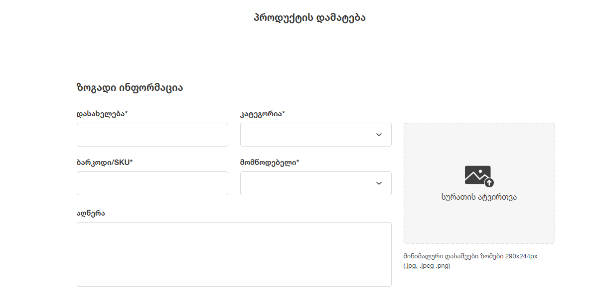
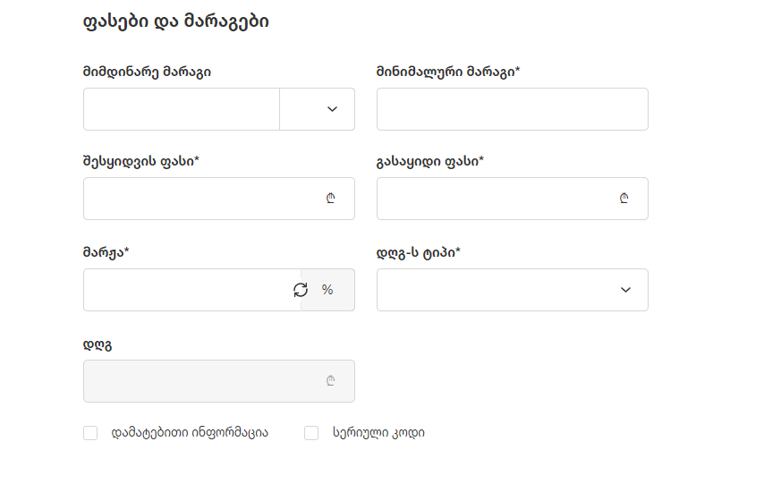
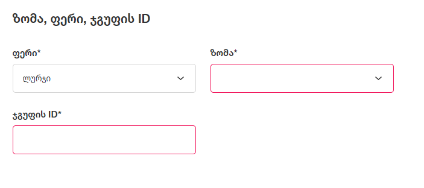
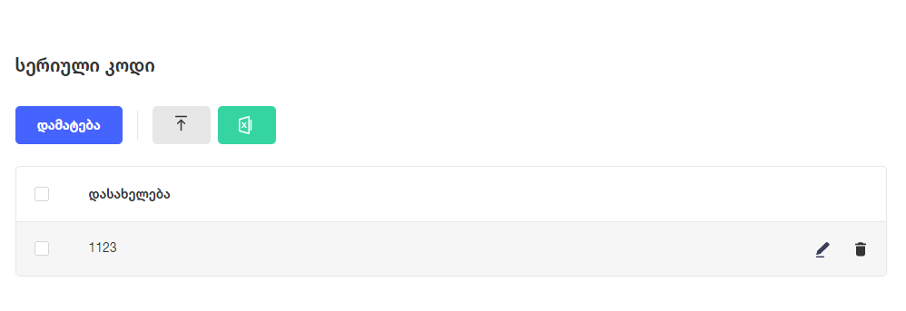
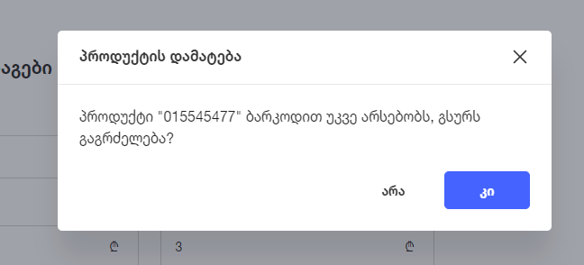
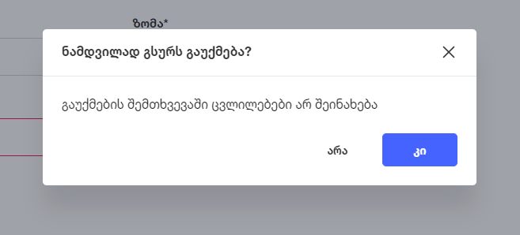

# **პროდუქტების დამატების აღწერა**

# **შესავალი**

პროდუქტების დამატება შესაძლებელია ინდივიდიუალურად, პროდუქტების დამატების გვერდიდან, ან [პროდუქტების ატვირთვით](product_import.md). პროდუქტების დამატების გვერდიდან, ატვირთვისგან განსხვავებით, შესაძლებელია სერიული კოდების და დამატებითი ინფორმაციის მითითება.

## ზოგადი ინფორმაცია

პროდუქტის დამატებისას მომხმარებელმა უნდა შეავსოს ზოგადი ინფორმაციის ველები (*-ით მონიშნული ველები სავალდებულოა):

- დასახელება* - ტექსტური ველი
- კატეგორია* - დროფდაუნი
- ბარკოდი/SKU* - ტექსტური ველი
- მომწოდებელი* - დროფდაუნი
- აღწერა - ტექსტური ველი (მაქსიმალური სიგრძე 600 სიმბოლო)
- სურათი

კატეგორიის და მომწოდებლის დროფდაუნებს გაააჩნიათ ახალი კატეგორიის ან მომწოდებლის დამატების ფუნქციონალი.

## ფასები და მარაგები

პროდუქტის დამატებისას მომხმარებელმა უნდა შეავსოს ფასების და მარაგების ველები:

- მიმდინარე მარაგი - რიცხვი, >= 0
- ერთეული - დროფდაუნი
- მინიმალური მარაგი* - რიცხვი
- შესყიდვის ფასი* - რიცხვი, > 0
- გასაყიდი ფასი* - რიცხვი, > 0
- მარჟა* - რიცხვი
- დღგ-ს ტიპი* - დროფდაუნი
- დღგ - ჩამქრალი (disabled) ველი

მომხმარებელს შეუძლია მარჟის ინფორმაცია (მოგება / თვითღირებულება) ნახოს როგორც პროცენტში, ასევე ლარის მნიშვნელობითაც. დამატებით, შესაძლებელია მარჟის ველში ინფორმაციის შეყვანა და შეყვანილი ინფორმაციის შესაბამისად მოხდება გასაყიდი ფასის ცვლილება

დღგ-ს ველში მომხმარებელს შეუძლია მხოლოდ დღგ-ს მნიშვნელობის ნახვა, რომელიც დამოკიდებულია **დღგ-ს ტიპის** ველის არჩევანზე. **ჩვეულებრივის** არჩევის შემთხვევაში დღგ არის (გასაყიდი ფასი * 18) / 118, სხვა შემთხვევაში 0

## დამატებითი ინფორმაცია

დამატებითი ინფორმაციის მონიშვნის შემთხვევაში, მომხმარებელს შეუძლია პროდუქტზე მიუთითოს შემდეგი ინფორმაცია:

- ფერი* - დროფდაუნი
- ზომა* - დროფდაუნი
- ჯგუფის ID* - რიცხვი

დამატებითი ინფორმაციის ველები ძირითადად გამოიყენება ადაპტერის კომპანიების მიერ. ფერის და ზომის მნიშვნელობების დამატება ხდება ადმინ პანელში. ჯგუფის ID გამოიყენება ექსტრას მხარეს ერთი და იმავე მოდელის პროდუქტების დასაჯგუფებლად.

## სერიული კოდი

სერიული კოდის მონიშვნის შემთხვევაში პროდუქტის დამატების გვერდზე გამოდის ცხრილი, რომლის მეშვეობით მომხმარებელს შეუძლია პროდუქტზე სერიული კოდების დამატება.
დამატება ღილაკზე დაჭერით, გამოვა პოპაპ ფანჯარა, რომელშიც მომხმარებელს შეუძლია სერიული კოდის შეყვანა (სერიული კოდი უნდა იყოს უნიკალური). ასევე შესაძლებელია ექსელის ფორმის ჩამოტვირთვა და სერიული კოდების ექსელის სახით ატვირთვა.

პროდუქტზე სერიული კოდის მინიჭების და შენახვის შემთხვევაში, პროდუქტი ჩაითვლება სერიოული კოდის მქონე პროდუქტად და გაივლის, თუნდაც, POS-ში სერიული კოდიანი პროდუქტის flow-ს. პროდუქტზე სერიული კოდების ამოყიდვის შემთხვევაშიც, პროდუქტი რჩება სერიულ კოდიან პროდუქტად

## შენახვა

შენახვა ღილაკზე დაჭერით პროდუქტი ხდება პროდუქტის შექმნა.
თუ მომხმარებელს შეყავს ბარკოდი, რომელიც რომელიმე არსებულ პროდუქტს უკვე გააჩნია, გამოვა პოპაპ ფანჯარა:

იმ შემთხვევაში თუ მომხმარებელი დაეთანხმა, პროდუქტი შეიქმნება როგორც ასორტიმენტის პროდუქტი

## გაუქმება (X)

გაუქმება ღილაკზე დაჭერით, თუ მომხმარებელს შეყვანილი ყავს რაიმე ინფორმაცია გამოვა პოპაპ ფანჯარა:

