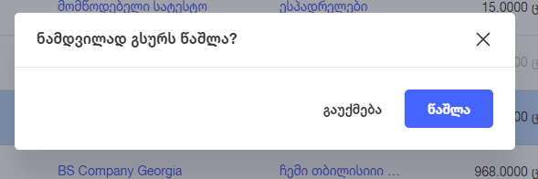

# პროდუქტების წაშლის აღწერა

პროდუქტების ცხრილზე ჩანაწერის / ჩანაწერების მონიშვნის და წაშლა ღილაკზე დაჭერის შემთხვევაში ან ჩანაწერის ჰოვერზე წაშლის აიქონზე დაჭერით გამოვა პოპაპ ფანჯარა:

პროდუქტის წაშლის შემთხვევაში პროდუქტი წაიშლება ყველა ფილიალიდან, ვინაიდან პროდუქტები ოპტიმოში არის გლობალური, რაც ნიშნავს, რომ დამატებული პროდუქტი ხელმისაწვდომია ყველა ფილიალში.

პროდუქტის წაშლის შემთხვევაში, სტატისტიკური ინფორმაცია არ იშლება. ზოგად,  კატეგორიების სტატისტიკაში და ბუღალტერია - გაყიდვებში კვლავ არის შესაზლებელი ამ პროდუქტის გაყიდვიდან დაგენერირებული ინფორმაციის ნახვა. პროდუქტების სტატისტიკაში ამ პროდუქტის სტატისტიკის ინდივიდუალურად ნახვა შესაძლებელი აღარაა, ვინაიდან წაიშალა.

იმ შემთხვევაში, თუ მომხმარებელი ხელახლა დაამატებს წაშლილი ბარკოდის პროდუქტის შესაბამის ახალ პროდუქტს, მოხდება სტატისტიკური ინფორმაციის ახლიდან ათვლა