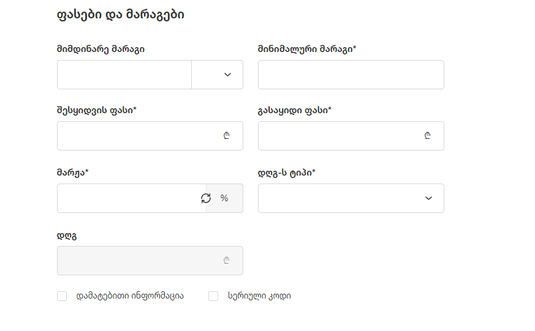
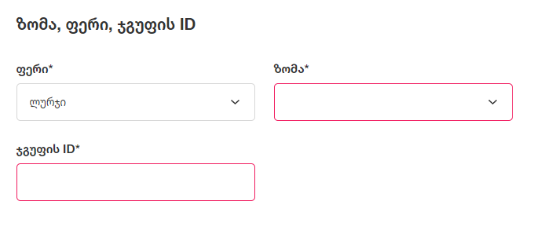
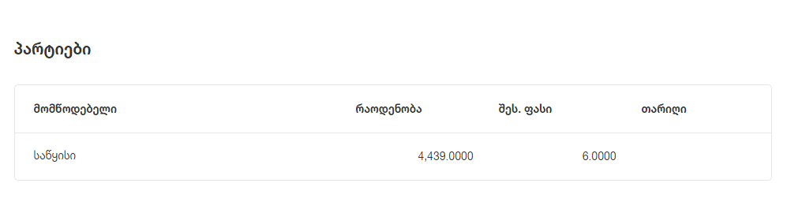

# პროდუქტების რედაქტირების აღწერა

# **შესავალი**

პროდუქტების რედაქტირების გვერდზე შესაძლებელია პროდუქტის ძირითადი ინფორმაციის ცვლილება და პარტიების ინფორმაციის ნახვა

## ზოგადი ინფორმაცია

პროდუქტის რედაქტირებისას მომხმარებელს შეუძლია შეცვალოს ზოგადი ინფორმაციის ველები (*-ით მონიშნული ველები სავალდებულოა):

- დასახელება* - ტექსტური ველი
- კატეგორია* - დროფდაუნი
- ბარკოდი/SKU* - ტექსტური ველი
- მომწოდებელი* - დროფდაუნი
- აღწერა - ტექსტური ველი (მაქსიმალური სიგრძე 600 სიმბოლო)
- სურათი

კატეგორიის და მომწოდებლის დროფდაუნებს გაააჩნიათ ახალი კატეგორიის ან მომწოდებლის დამატების ფუნქციონალი.

## ფასები და მარაგები

პროდუქტის რედაქტირებისას მომხმარებელს შეუძლია შეცვალოს ფასების და მარაგების ველები:

- მიმდინარე მარაგი - რიცხვი, >= 0
- მინიმალური მარაგი* - რიცხვი
- გასაყიდი ფასი* - რიცხვი, > 0
- ფასის განახლების თარიღი*
- დღგ-ს ტიპი* - დროფდაუნი

მიმდინარე მარაგის ცვლილების შეთხვევაში, გამოდის პოპაპ ფანჯარა, რომელშიც მომხმარებელმა უნდა მიუთითოს მარაგის განახლების (ინვენტარიზაციის) მიზეზი.
მიზეზი **ნამატის** არჩევის შემთხვევაში, მომხმარებელს შეუძლია რაოდენობაში  > 0 რიცხვების ჩაწერა. მოცემული პროდუქტის მარაგი გაიზრდება მომმარებლის მიერ ჩაწერილი რიცხვით. ნებისმიერი სხვა (იდეურად მინუსიანი) მიზეზის არჩევისას მომხმრებელს შეუძლია რაოდენობაში ჩაწეროს > 0 რიცხვი. თუ მომხმარებელი შეიყვანს არსებულ მარაგზე მეტ რიცხვს, გამოვა შეტყობინება:

- შეიყვანეთ არსებულ მარაგზე მცირე რიცხვი

## დამატებითი ინფორმაცია

დამატებითი ინფორმაციის მონიშვნის შემთხვევაში, მომხმარებელს შეუძლია პროდუქტზე მიუთითოს შემდეგი ინფორმაცია:

- ფერი* - დროფდაუნი
- ზომა* - დროფდაუნი
- ჯგუფის ID* - რიცხვი

დამატებითი ინფორმაციის ველები ძირითადად გამოიყენება ადაპტერის კომპანიების მიერ. ფერის და ზომის მნიშვნელობების დამატება ხდება ადმინ პანელში. ჯგუფის ID გამოიყენება ექსტრას მხარეს ერთი და იმავე მოდელის პროდუქტების დასაჯგუფებლად.

## სერიული კოდი

სერიული კოდის მონიშვნის შემთხვევაში პროდუქტის დამატების გვერდზე გამოდის ცხრილი, რომლის მეშვეობით მომხმარებელს შეუძლია პროდუქტზე სერიული კოდების დამატება / რედაქტირება.
დამატება ღილაკზე დაჭერით, გამოვა პოპაპ ფანჯარა, რომელშიც მომხმარებელს შეუძლია სერიული კოდის შეყვანა (სერიული კოდი უნდა იყოს უნიკალური). ასევე შესაძლებელია ექსელის ფორმის ჩამოტვირთვა და სერიული კოდების ექსელის სახით ატვირთვა.

პროდუქტზე სერიული კოდის მინიჭების და შენახვის შემთხვევაში, პროდუქტი ჩაითვლება სერიოული კოდის მქონე პროდუქტად და გაივლის, თუნდაც, POS-ში სერიული კოდიანი პროდუქტის flow-ს. პროდუქტზე სერიული კოდების ამოყიდვის შემთხვევაშიც, პროდუქტი რჩება სერიულ კოდიან პროდუქტად

## პარტიები

პარტიების სექტორში, მომხმარებელს ცხრილის სახით შეუძლია ამ პროდუქტზე პარტიების ინფორმაციის ნახვა.

ცხრილის სვეტებია:

- მომწოდებელი
- რაოდენობა
- შეს. ფასი
- თარიღი

## შენახვა

შენახვა ღილაკზე დაჭერით პროდუქტი ხდება პროდუქტის შექმნა

## გაუქმება (X)

გაუქმება ღილაკზე დაჭერით, თუ მომხმარებელს შეყვანილი ყავს რაიმე ინფორმაცია გამოვა პოპაპ ფანჯარა:

