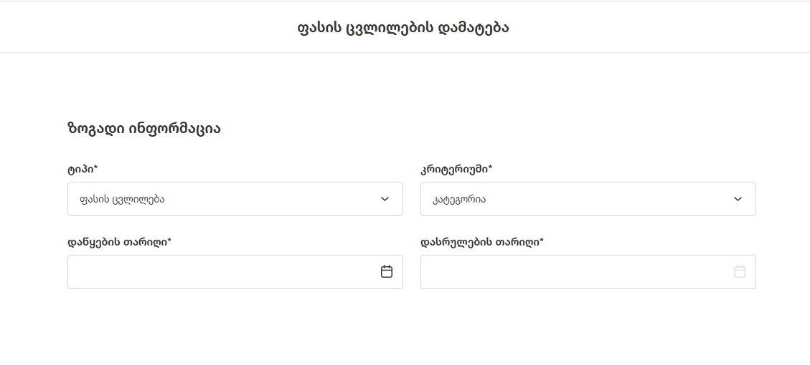
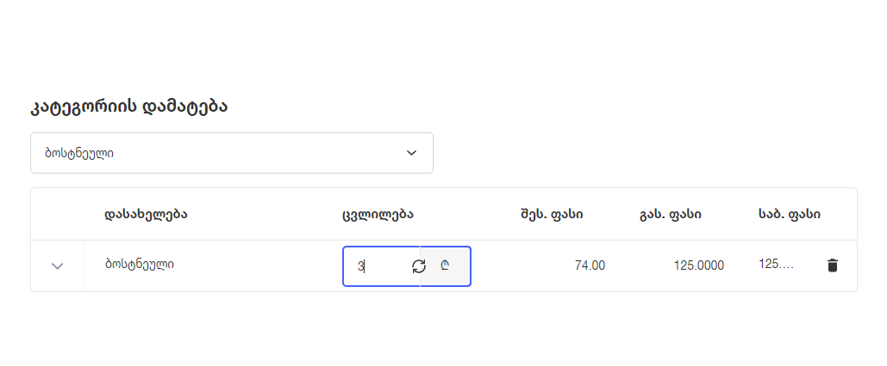
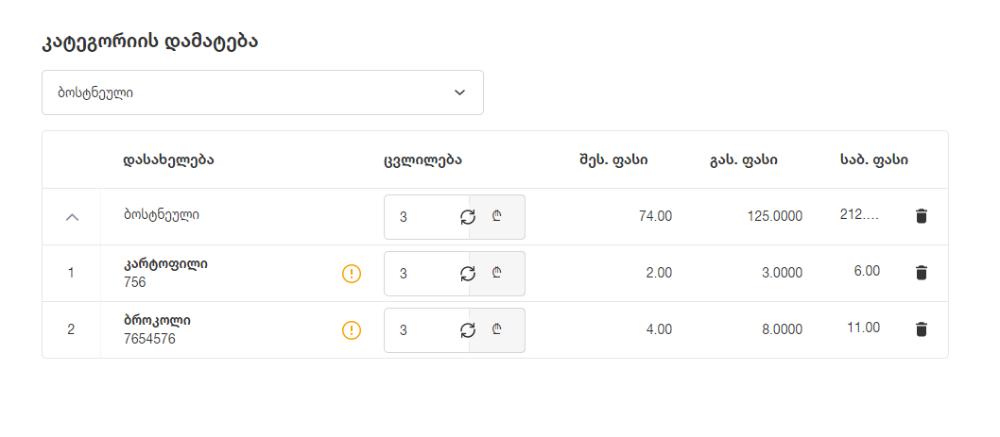
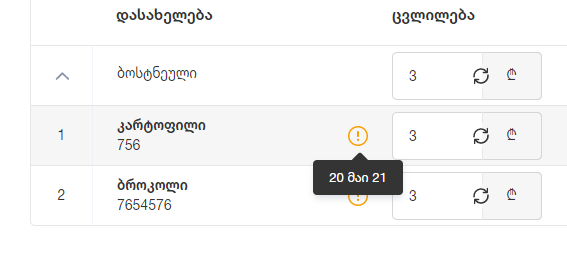

# ფასების ცვლილების აღწერა

## შესავალი

ფასების ცვლილების გვერდზე, მომხმარებელს შეუძლია ერთდროულად ბევრ პროდუქტზე ფასების ცვლილება, როგორც რიცხვობრივი ნამატით / დანაკლისით, ასევე - პროცენტით

## ზოგადი ინფორმაცია

ზოგადი ინფორმაცია შედგება შემდეგი ველებისგან (*-ით მონიშნული ველები სავალდებულოა):

- ტიპი* - ასარჩევი ველი
- კრიტერიუმი* - ასარჩევი ველი
- დაწყების თარიღი* - თარიღის ველი
- დასრულების თარიღი* - თარიღის ველი (*მხოლოდ ფასდაკლების შემთხვევაში*)

ტიპის ველი შედგება ორი არჩევანისგან:

- ფასის ცვლილება
- ფასდაკლება

ფასის ცვლილება, როგორც ქმედება, მოიაზრებს პროდუქტებზე გასაყიდი ფასის ცვლილებას დაწყების თარიღიდან უსასრულობამდე (*არ არსებობს თარიღი, რომელშიც ეს ფასი გაუქმდება / დასრულდება*). ფასდაკლება, ფასის ცვლილებისგან განსხვავებით, მოიაზრებს გასაყიდი ფასის დასრულების თარიღს. ნებისმიერი ქმედება, რომელიც ფასდაკლებაა, უნდა დაიწყოს მომხმარებლის მიერ არჩეულ დაწყების თარიღში და უნდა დასრულდეს მომხმარებლის მიერ არჩეულ დასრულების თარიღში.
კრიტერიუმის ველში, მომხმარებელი ირჩევს იმ კრიტერიუმს, რის მიხედვითაც უნდა მოხდეს გასაყიდი ფასის განახლება. კრიტერიუმი შეიძლება იყოს:

- კატეგორია, 
- მომწოდებელი 
- პროდუქტი

კატეგორიის ან მომწოდებლის არჩევის შემთხვევაში, მომხმარებელს შეუძლია მხოლოდ ერთი არჩევნის გაკეთება(მაგ: თუ მომხმარებელს ყავს რამდენიმე მომწოდებელი დამაეტბული, ერთ ქმედებაზე მხოლოდ ერთი მომწოდებლის ფასები შეიძლება შეცვალოს).

## ცვლილების დამატება

კრიტერიუმის არჩევის შემდეგ, მომხმარებელი ირჩევს კონკრეტულად რომელ კატეგორიაზე, მომწოდებელზე ან პროდუქტებზე სურს ფასის ცვლილება. ცვლილების გადამრთველით მომხმარებელი აკონტროლებს, სურს ქმედების გაკეთება რიცხვითი მნიშვნელობით თუ პროცენტით. **ცვლილების ველში შესაძლებელია როგორც დადებითი, ასევე უარყოფითი რიცხვების შეყვანა**. მაგ: თუ მომხმარებელი რომელიმე კატეგორიაზე გააკეთებს +3 ₾ ცვლილებას, ამ კატეგორიის ყველა პროდუქტის ფასი გაიზრდება 5 ლარით.

მომხმარებელს შეუძლია კატეგორიის  ჩამოშლა და კრიტერიუმში შემავალი პროდუქტების ინდივიდუალურად კორექტიერბა / ცვლილება. ასევე შესაძლებელია, ინდივიდუალური პროდუქტების ამოშლა, თუ მომხმარებელს რაიმე მიზეზით არ სურს პროდუქტის ფასის განახლება.  
  
Tooltip-ზე მაუსის მიტანის შემთხვევაში მომხმარებელი დაინახავს ბოლო 2 ფასის ცვლილების თარიღს 