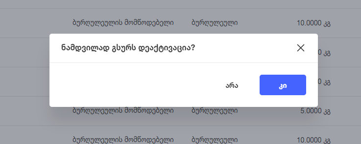

# პროდუქტების ცხრილის აღწერა

## შესავალი

პროდუქტების გვერდზე მომხმარებელი ხედავს პროდუქტების კატალოგთან დაკავშირებულ ყველა ინფორმაციას.
პროდუქტების გვერდზე მომხმარებელს შეუძლია ისეთი ქმედებების გაკეთება, რომელიც დაკავშირებულია პროდუქტებთან, პროდუქტების ფასებთან ან მარაგებთან.

## ცხრილის ფუნქციონალი

### სვეტები

პროდუქტების გვერდზე არის ცხრილი, რომლის სვეტებია:

- ჩანაწერების მონიშვნა
- რჩეულებში დამატება
- დასახელება
- მომწოდებელი
- კატეგორია
- რაოდენობა
- შეს. ფასი
    - შესყიდვის ფასის კალკულაცია ხდება საშუალო შეწონილის ფორმულით - sumproduct(რაოდენობა, ღირებულება)/sum(რაოდენობა)
- გასაყიდი ფასი
- მარჟა
- დღგ

ცხრილის **ყველა** სვეტზე (მომწოდებლის გარდა, ვინაიდან შესაძლოა ერთ პროდუქტს ქონდეს ერთზე მეტი მომწოდებელი) შესაძლებელია სორტირება და ფილტრაცია.
მომხმარებელს შეუძლია სვეტების ასარჩევი ელემენტიდან **მხოლოდ** შემდეგი სვეტების ჩართვა / ამორთვა:

- შეს. ფასი
- გასაყიდი ფასი
- მარჟა
- დღგ

ცხრილში, თითოეულ ჩანაწერზე, მომხმარებელს შეუძლია:

- მონიშვნა
- რჩეულებში დამატება / რჩეულებიდან წაშლა
- პროდუქტის View-ს ნახვა
- მომწოდებლის View-ს ნახვა
- კატეგორიის View-ს ნახვა

### ჩანაწერების მონიშვნის ფუნქციონალი

ჩანაწერების მონიშვნას აქვს სამი მდგომარეობა

- თუ არცერთი ჩანაწერი არ აქვს მომხმარებელს მონიშნული შესაძლებელია დაკლიკვით ყველა ჩანაწერი მონიშნოს
- თუ ერთი ჩანაწერი აქვს მომხმარებელს მონიშნული, დაკლიკვით შეუძლია ყველა ჩანაწერი მონიშნოს
- თუ ყველა ჩანაწერი აქვს მომხმარებელს მონიშნული, დაკლიკვით შეუძლია ყველა ჩანაწერს მონიშვნა გაუთიშოს

### რჩეულების ფუნქციონალი

რჩეულების ფუნქციონალს აქვს სამი მდგომარეობა

- თუ ცხრილში მომხმარებელს არცერთი პროდუქტი არ აქვს რჩეულში, რჩეულების ღილაკზე დაჭერით ყველა ჩანაწერი გახდება რჩეული
- თუ ცხრილში მომხმარებელს ერთი პროდუქტი მაინც აქვს არჩეული, რჩეულების ღილაკზე დაჭერით ყველა ჩანაწერი გახდება რჩეული
- თუ ცხრილში ყველა ჩანაწერი არის რჩეული, რჩეულების ღილაკზე დაჭერით მოხდება ყველა რჩეული ჩანაწერის დეაქტივაცია

რჩეულებში დამატება / დაეაქტივაცია დამოკიდებულია pagination-ზე. მაგ: თუ ცხრილში, არის მხოლდ 10 ჩანაწერი, რჩეულებში ყველას მონიშნის შემთხვევაში, მხოლოდ 10 ჩანაწერი დაემატება რჩეულებს

ჩანაწერის რჩეულიდან დეაქტივაციისას, გამოდის პოპაპ ფანჯარა:

### View

ნებისმიერ ჩანაწერზე დაჭერისას მომხმარებელი ხედავს პროდუქტის view-ს. View-დან შესაძლებელია პროდუქტის რედაქტირება, წაშლა და ინფორმაციის ნახვა

### ჰოვერის ფუნქციონალი

ცხრილის ჩანაწერებზე კურსორის მიტანისას (ჰოვერზე) მომხმარებელს შეუძლია შემდეგი სამი ექშენის გაკეთება:

- დამალვა / გამოჩენა (თუ ჩანაწერი დამალულია - გამოჩენა, თუ გამოჩენილი - დამალვა)
- რედაქტირება
- წაშლა

დამალული პროდუქტები არ ჩანან პოს-ში

### ღილაკები

#### დამატება

> **პროდუქტების დამატების ღილაკი ჩანს არცერთი ჩანაწერის მონიშვნის შემთხვევაში**

პროდუქტების დამატების შესახებ ინფორმაციის ნახვა შესაძლებელია [პროდუქტების დამატების](add_products.md) გვერდზე

#### რედაქტირება

> **პროდუქტების დამატების ღილაკი ჩანს არცერთი ჩანაწერის მონიშვნის შემთხვევაში**

პროდუქტების რედაქტირების შესახებ ინფორმაციის ნახვა შესაძლებელია [პროდუქტების რედაქტირების](edit_products.md) გვერდზე

#### წაშლა

> **პროდუქტების წაშლის ღილაკი ჩანს 1 ან 1-ზე მეტი ჩანაწერის მონიშვნის შემთხვევაში**

პროდუქტების წაშლის შესახებ ინფორმაციის ნახვა შესაძლებელია [პროდუქტების წაშლის](delete_products.md) გვერდზე

#### ფასების სინქრონიზაცია

> **ფასების სინქრონიზაციის ღილაკი ჩანს არცერთი ჩანაწერის მონიშვნის შემთხვევაში**

ფასების სინქრონიზაციისას მომხმარებელი ირჩევს ფილიალს, რომლიდანაც არსებულ ფილიალში მოხდება ფასების გადმოტანა. მაგ: თუ B ფილიალში პროდუქტ 12345-ზე ფასი არის 5₾, ხოლო A ფილიალში - 3₾, ფასების სიქრონიზების შემდეგ, A ფილიალში პროდუქტის ფასი გახდება 5₾

#### ფასების ცვლილება

> **ფასების ცვლილების ღილაკი ჩანს არცერთი ჩანაწერის მონიშვნის შემთხვევაში**

**TODO**

#### RS-დან ჩამოტვირთვა

> **RS-დან ჩამოტვირთვის ღილაკი ჩანს არცერთი ჩანაწერის მონიშვნის შემთხვევაში**

RS-დან პროდუქტების ჩამოტვირთვისას, მომხმარებელს შეუძლია (**მხოლოდ იმ შემთხვევაში, თუ RS-ის პარამეტრები გაწერილია**) RS-დან მის ექაუნთთან დაკავშირებული პრიდუქტების ჩამოტვირთვა. მომხმარებელს შეუძლია ჩამოტვირთოს 3, 6, 9, 12 თვის პროდუქტები. 

#### პროდუქტების ატვირთვა

> **პროდუქტების ჩამოტვირთვის ღილაკი ჩანს არცერთი ჩანაწერის მონიშვნის შემთხვევაში**

პროდუქტების ატვირთვისთვის, აუცილებელია მომხმარებელმა პირველ რიგში ჩამოტვირთოს პროდუქტების ატვირთვის ფორმა, შეავსოს და ფორმის ატვირთვის გამოყენებით, შევსებული ფაილი ატვირთოს. აუცილებელია მომხმარებელმა პროდუქტების ასატვირთი ექსელის ფაილი, ფორმა, არ გააფუჭოს (მაგ: ამოაკლოს სვეტები, წაშალოს ან დაუმატოს ფაილს ახალი გვერდები, ა.შ) იმ შემთხვევაში, თუ მომხმარებელი ასატვირთ ფაილს გააფუჭებს, არ მოხდება ფაილის ატვირთვა და გამოვა შეტყობიენბა: **დაფიქსირდა შეცდომა**
იმ შემთხვევაში თუ მომხმარებელი სტრუქტურულად სწორ ფაილს ატვირთავს, ფაილში არსებული დატიდან გამომდინარე, შესაძლებელია მოხდეს შემდეგი სიტუაციები:

- ფაილი წარმატებით აიტვირთოს და შეიქმნას ახალი პროდუქტები
- თუ ფაილში მოცემული ბარკოდის პროდუქტი უკვე არსებობს ოპტიმოში, ფაილში მოცემული გასაყიდი ფასი გახდება პროდუქტის გასაყიდი ფასი
- **TODO** result.xlsx

#### ექსპორტი სასწორისთვის

> **ექსპორტი სასწორისთვის ღილაკი ჩანს არცერთი ჩანაწერის მონიშვნის შემთხვევაში**

სასწორის ექსპორტის ფუნქციონალის გამოყენებისას, მოხმმარებელს შეუძლია აირჩიოს

- DIGI SM-320 - ამ ოფშენის არჩევისას, ჩამოიტვირთება ექსელის ფაილი, რომლის შეტვირთვაც შესაძლებელია DIGI SM-320 სასწორზე. ჩამოტვირთულ ფაილში სტრიქონების რაოდენობა ყოველთვის არის 6500
- Shrih-Print M - ამ ოფშენის არჩევისას, ჩამოიტვირთება ტექსტური ფაილი, რომლის შეტვირთვაც შესაძლებელია Shtrih-Print M სასწორზე. ჩამოტვირთულ ფაილში სტრიქონების რაოდენობა ყოველთვის არის 9999

#### ექსელში ექსპორტი

> **ექსელში ექსპორტის ღილაკი ჩანს არცერთი ჩანაწერის მონიშვნის შემთხვევაში**

ექსელში ექსპორტის ღილაკზე დაჭერისას, მომხმარებელი ჩამოტვირთავს ექსელის ფაილს, რომელშიც ფილიალის მონაცემების მიხედვით შესაძლებელია ყველა პროდუქტზე არსებული ინფორმაციის ნახვა:

- ბარკოდი
- საქონლის დასახელება
- ზომის ერთეული
- მომწოდებელი
- კატეგორია
- დღგ-ს ტიპი
- მიმდინარე მარაგი
- მინიმალური მარაგის ზღვარი
- თვითღირებულება
- გასაყიდი ფასი
- ფერი
- ზომა
- GroupId
- მარჟა

#### ბარკოდის ბეჭდვა

> ბარკოდის ბეჭდვის ღილაკი ჩანს 1 ან მეტი ჩანაწერის მონიშვნის შემთხვევაში

ბარკოდის ბეჭდვის ფუნქციონალის ჭრილში გამოდის ბეჭდვის ფანჯარა, რომელშიც მომხმარებელი ხედავს მონიშნული პროდუქტის/პროდუქტების ფასმაჩვენებელს. მომხმარებელს შეუძლია ფანჯარაში ბეჭდვის ოფშენების საჭიროებისამებრ ცვლილება და დაბეჭდვა

<!-- #### არცერთი ჩანაწერის მონიშვნის შემთხვევაში ჩანს ღილაკები:

- [დამატება](add_products.md) 
- [ფასების სინქრონიზაცია](price_synch.md)
- [ფასების ცვლილება](price_change.md)
- [RS-დან ჩამოტვირთვა](rs_import_products.md)
- [პროდუქტების ატვირთვა](product_import.md) 
    - ფორმის ჩამოტვირთვა
    - ფორმის ატვირთვა
- [ექსპორტი სასწორისთვის](scales_export.md)
    - DIGI SM-320
    - Shtrih-Print M
- [ექსელში ექსპორტი](excel_export.md)

#### ერთი ჩანაწერის მონიშვნის შემთხვევაში ჩანს ღილაკები:

- [რედაქტირება](edit_products.md) 
- [წაშლა](delete_products.md) 
- [ბარკოდის ბეჭდვა](print_barcode.md) 

#### ერთზე მეტი ჩანაწერის მონიშვნის შემთხვევაში ჩანს ღილაკები:

- [წაშლა](delete_products.md)
- [ბარკოდის ბეჭდვა](print_barcode.md)  -->