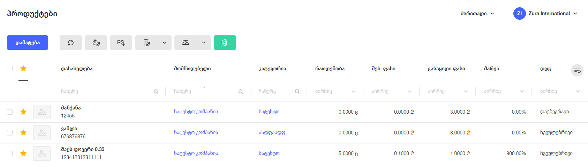

# **პროდუქტების ცხრილის აღწერა**

## **სვეტები**
პროდუქტების გვერდზე არის ცხრილი, რომლის სვეტებია:

- ჩანაწერების მონიშვნა
- რჩეულებში დამატება
- დასახელება
- მომწოდებელი
- კატეგორია
- რაოდენობა
- შეს. ფასი
- გასაყიდი ფასი
- მარჟა
- დღგ

ცხრილის **ყველა** სვეტებზე შესაძლებელია სორტირება და ფილტრაცია.
მომხმარებელს შეუძლია სვეტების ასარჩევი ელემენტიდან **მხოლოდ** შემდეგი სვეტების ჩართვა / ამორთვა:

- შეს. ფასი
- გასაყიდი ფასი
- მარჟა
- დღგ

### ჩანაწერების მონიშვნის ფუნქციონალი

ჩანაწერების მონიშვნას აქვს 3 მდგომარეობა
- თუ არცერთი ჩანაწერი არ აქვს მომხმარებელს მონიშნული შესაძლებელია დაკლიკვით ყველა ჩანაწერი მონიშნოს
- თუ 1 ჩანაწერი აქვს მომხმარებელს მონიშნული, დაკლიკვით შეუძლია ყველა ჩანაწერი მონიშნოს
- თუ ყველა ჩანაწერი აქვს მომხმარებელს მონიშნული, დაკლიკვით შეუძლია ყველა ჩანაწერს მონიშვნა გაუთიშოს

### რჩეულების ფუნქციონალი

რჩეულების ფუნქციონალს აქვს 3 მდგომარეობა
- თუ ცხრილში მოხმმარებელს არცერთი პროდუქტი არ აქვს რჩეულში, რჩეულების ღილაკზე დაჭერით ყველა ჩანაწერი გახდება რჩეული
- თუ ცხრილში მომხმარებელს 1 პროდუქტი მაინც აქვს არჩეული, რჩეულების ღილაკზე დაჭერით ყველა ჩანაწერი გახდება რჩეული
- თუ ცხრილში ყველა ჩანაწერი არის რჩეული, რჩეულების ღილაკზე დაჭერით მოხდება ყველა რჩეული ჩანაწერის დეაქტივაცია

### **ღილაკები**

#### 0 ჩანაწერის მონიშვნის შემთხვევაში ჩანს ღილაკები:

- დამატება
- ფასების სინქრონიზაცია
- ფასების ცვლილება
- RS-დან ჩამოტვირთვა
- პროდუქტების ატვირთვა
    - ფორმის ჩამოტვირთვა
    - ფორმის ატვირთვა
- ექსპორტი სასწორისთვის
    - DIGI SM-320
    - Shtrih-Print M
- ექსელში ექსპორტი

#### 1 ჩანაწერის მონიშვნის შემთხვევაში ჩანს ღილაკები:

- რედაქტირება
- წაშლა
- ბარკოდის ბეჭდვა

#### >1 ჩანაწერის მონიშვნის შემთხვევაში ჩანს ღილაკები:

- წაშლა
- ბარკოდის ბეჭდვა

### **ჰოვერის ფუნქციონალი**

ცხრილის ჩანაწერებზე მაუსის მიტანისას (ჰოვერზე) მომხმარებელს შეუძლია შემდეგი სამი ექშენის გაკეთება:

- დამალვა / გამოჩენა (თუ ჩანაწერი დამალულია გამოჩენა, თუ გამოჩენილი - დამალვა)
- რედაქტირება
- წაშლა
